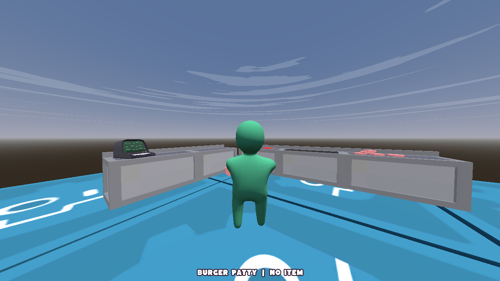

<div align="center">
  <h1>Chef Wobbles</h1> 
  <h3>A physics-based cooking game with cute, wobbly characters and calming pastel aesthetics</h3>
  
  <p>
    <a href="https://store.steampowered.com/search/?developer=Lost%20Rabbit%20Digital" target="_blank"></a>
    <a href="https://lost-rabbit-digital.itch.io" target="_blank"></a>
    <a href="https://godotengine.org/" target="_blank"></a>
    <a href="https://github.com/Lost-Rabbit-Digital/ChefWobbles/blob/main/LICENSE"></a>
  </p>
</div>

<div align="center">
  
</div>

---

## 📖 About The Game

**Chef Wobbles** is a cozy physics-based cooking game inspired by "A Short Hike" and "Overcooked". Players control adorable wobbly characters in a calming kitchen environment, creating delicious meals while enjoying satisfying physics interactions and beautiful pastel visuals.

In this relaxing culinary world, your goal is to:
- Cook delicious meals with realistic physics
- Chop, sauté, and prepare ingredients with wobbly precision
- Manage timing without the stress of traditional cooking games

---

<div align="center">
  <table>
    <tr>
      <td align="center"></td>
    </tr>
    <tr>
      <td align="center">
        <h3>Join our community!</h3>
        <p>Chat with developers, share recipes, report bugs, and get the latest updates on our games and plugins</p>
        <a href="https://discord.gg/Y7caBf7gBj" target="_blank">Join the Lost Rabbit Digital Server →</a>
      </td>
    </tr>
  </table>
</div>

### Why Join Our Discord?

- 💬 **Direct Developer Access** - Chat with the team and influence development
- 🎮 **Community Events** - Participate in cooking challenges and events
- 🔍 **Early Updates** - Be the first to know about new features and patches
- 🐛 **Bug Reports** - Help us improve by reporting issues
- 🍳 **Recipe Sharing** - Share your best wobbly cooking creations

---

## 🚀 Getting Started

### Prerequisites

<div align="center">
  <table>
    <tr>
      <td align="center"></td>
      <td><a href="https://godotengine.org/download">Godot Engine 4.4+</a></td>
    </tr>
  </table>
</div>

### Installation

```bash
# Clone the repository
git clone https://github.com/Lost-Rabbit-Digital/ChefWobbles.git

# Change to project directory
cd ChefWobbles

# Open the project in Godot using OS GUI
# Or execute Godot from terminal with following command:
godot -e
```

---

## 📚 Documentation

<div align="center">
  <a href="project_management/design_document.md">
    
  </a>
  <a href="project_management/asset_creation_guidelines.md">
    
  </a>
</div>

---

## 📜 License

<div align="center">
  <a href="LICENSE">
    
  </a>
</div>

---

## 🙏 Acknowledgements

<div align="center">
  <table>
    <tr>
      <td align="center"></td>
      <td><a href="project_management/external_assets.md">External Assets & Attributions</a></td>
    </tr>
    <tr>
      <td align="center"></td>
      <td><a href="https://godotengine.org/download">Godot Engine 4.4+</a></td>
    </tr>
    <tr>
      <td align="center"></td>
      <td><a href="https://github.com/PiCode9560/Godot-4-Active-ragdoll" target="_blank">Godot-4-Actiive-ragdoll by PiCode9560</a> for the base of the character controller</td>
    </tr>
  </table>
</div>

---

<div align="center">
🐰 Lost Rabbit Digital LLC 🐰
</div>
